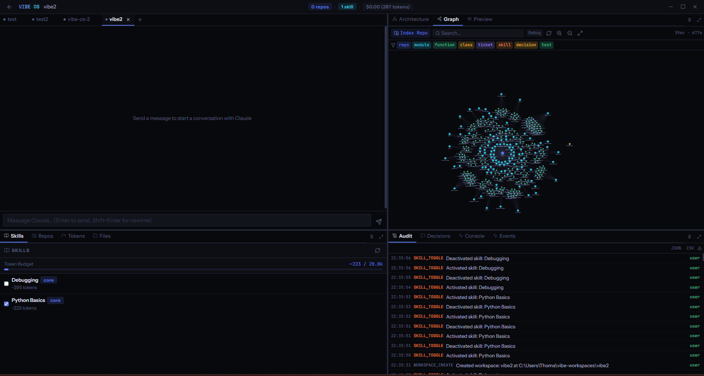

<p align="center">
  
  
  
  
  
</p>

<h1 align="center">
  <br />
  <code style="font-size: 2em;">VIBE OS</code>
  <br />
  <sub>Reasoning-First Agentic IDE</sub>
</h1>

<p align="center">
  <strong>See every decision. Direct every action. Audit everything.</strong>
  <br />
  A desktop IDE that turns Claude Code into a transparent, graph-aware coding partner.<br />
  Native agent loop on the Claude Agent SDK with custom MCP tools, knowledge-graph context injection,<br />
  and an append-only audit trail of every choice your agent makes.
</p>

<p align="center">
  <a href="#quick-start">Quick Start</a> &bull;
  <a href="#what-it-does">What It Does</a> &bull;
  <a href="#architecture">Architecture</a> &bull;
  <a href="#the-interface">Interface</a> &bull;
  <a href="#features-in-depth">Features</a> &bull;
  <a href="#testing">Testing</a>
</p>

---

## The Problem

AI coding tools are black boxes. You paste a prompt, hope for the best, and get back code you didn't watch being written. You can't see what context the model used, what decisions it made, or why it chose one approach over another. And every tool forces you to pay for API access on top of whatever subscription you already have.

**VIBE OS makes AI-assisted development visible, auditable, and directable — on top of your existing Claude Code subscription.**

---

## Quick Start

### Prerequisites

| Requirement | Version | Why |
|---|---|---|
| **Node.js** | 18+ | Frontend + sidecar build tooling |
| **Rust** | 1.89+ | Tauri backend compilation |
| **Claude Code CLI** | Latest | Auth + execution backend (`npm install -g @anthropic-ai/claude-code`) |
| **Git** | Any | Repository management |
| **NASM** | Any | Windows only — required by SurrealDB's crypto deps |

No Anthropic API key required. VIBE OS authenticates through your existing Claude Code subscription.

### Install & Run

```bash
# Clone
git clone https://github.com/TPal126/vibe-os.git
cd vibe-os

# Install frontend dependencies
npm install

# Build the Node agent sidecar (bundles the Claude Agent SDK)
cd agent-sidecar && npm install && npm run build && cd ..

# Run tests (164 tests across Rust + TypeScript)
npm run test:all

# Launch in development mode
npm run tauri dev

# Build distributable binary (Windows/macOS/Linux)
npm run tauri build
```

First launch creates `~/.vibe-os/vibe-os.db`, copies starter skill files to `~/.vibe-os/skills/`, and spawns the agent sidecar which auto-detects your installed `claude` binary and available CLIs (`git`, `gh`, `aws`, `docker`, `node`, `python`, etc.).

---

## What It Does

VIBE OS is a **reasoning-first desktop IDE** that owns the orchestration layer on top of Claude Code. Rather than wrapping the CLI, it runs a native agent loop via the **Claude Agent SDK** in a Tauri sidecar, injects graph-aware context before every query, and exposes a set of custom MCP tools that let Claude read and write the knowledge graph directly.

- **Native Agent SDK Loop** — `@anthropic-ai/claude-agent-sdk` running in a Node sidecar, not CLI stdout parsing
- **Graph-Native Context** — SurrealDB knowledge graph queried and injected into every system prompt
- **VIBE OS MCP Tools** — 6 custom tools let Claude access provenance, impact analysis, architecture topology, and record its own decisions
- **Multi-Project Home** — project cards with resource summaries, delete support, up to 20 concurrent projects
- **Project Setup Flow** — unified resource catalog (repos, skills, agents) with checkbox composition and drag-drop repo adding
- **Unified Events Timeline** — single append-only log with both actions and decisions, kind-tagged, exportable
- **Auto-Detected CLIs** — `git`, `gh`, `aws`, `docker`, `kubectl`, `node`, `npm`, `python`, `cargo`, etc. surfaced in system prompt and title bar
- **Light + Dark Themes** — CSS-variable driven, toggle in title bar, persists across sessions
- **Multi-Session Agents** — run multiple Claude sessions simultaneously with attention routing
- **Agent Capture** — save Claude-spawned subagents as reusable `.md` definitions in `~/.vibe-os/agents/`
- **Knowledge Graph Visualizer** — D3 force-directed view of repos, modules, functions, decisions, and sessions

---

## Architecture

### Three-Process Design

```
+-----------------------------------------------------+
|                    Frontend                          |
|   React 18 . TypeScript 5.5 . Zustand . Tailwind    |
|   Monaco . D3.js . Vite 6 . Lucide icons            |
+-----------------------------------------------------+
                          |
                   Tauri IPC Bridge
                          |
+-----------------------------------------------------+
|                  Rust Backend                         |
|   SQLite (WAL) . SurrealDB (embedded)               |
|   Graph context assembly . Tool handler dispatch     |
|   Sidecar lifecycle + stdin/stdout bridge            |
+-----------------------------------------------------+
                          |
              stdin/stdout JSON lines
                          |
+-----------------------------------------------------+
|              Node Agent Sidecar                       |
|   @anthropic-ai/claude-agent-sdk                    |
|   SDK query() async generator + streamInput()       |
|   VIBE OS MCP server with 6 custom tools            |
+-----------------------------------------------------+
                          |
                          v
                  Claude Code binary
              (auth + model execution)
```

**Why this architecture:**

- **No API key cost** — the SDK uses your Claude Code subscription, not direct Anthropic API access
- **Typed messages** — SDK emits structured `SDKAssistantMessage` / `SDKResultMessage` events directly, no stdout parsing gymnastics
- **Graph context injection** — Rust assembles provenance and session history from SurrealDB before each query and appends it to the system prompt
- **Custom tools** — the sidecar exposes a VIBE OS MCP server whose tools call back into Rust for graph queries
- **Zero wrapper overhead** — we control the full prompt composition, tool orchestration, and event routing

### VIBE OS MCP Tools

The sidecar exposes an in-process MCP server with tools that give Claude direct access to your knowledge graph:

| Tool | Purpose |
|---|---|
| `vibe_graph_provenance` | Decision history, skill attribution, and test coverage for a function |
| `vibe_graph_impact` | Direct + indirect callers, dependent tickets, validating tests |
| `vibe_record_decision` | Agent records architectural choices with rationale, confidence, reversibility |
| `vibe_search_graph` | Free-text search across functions, modules, decisions, skills |
| `vibe_session_context` | Current session's action history, decisions, token spend |
| `vibe_architecture` | Module topology, import graph, call graph for a subsystem |

When Claude calls any of these, the request flows sidecar → Rust → SurrealDB → back to the SDK as a tool result. No guessing, no hallucinated history — the agent sees what actually happened.

### Graph-Native Context Assembly

Before every `query()` call, Rust extracts file and function references from the user's message, queries SurrealDB for provenance (decisions, skill attribution, test coverage) and session history, and injects it into the system prompt under a `# VIBE OS Context` section. This is where VIBE OS gets meaningfully smarter than raw Claude Code.

---

## The Interface

### Home Screen

```
+-----------------------------------------------------------------------+
|  VIBE OS                        6 CLIs  0 repos  1 skill  $0.00  - x  |
+-----------------------------------------------------------------------+
|                                                                       |
|   PROJECTS                                                            |
|                                                                       |
|   +-------------------+  +-------------------+  +-----------------+   |
|   | vibe-os       (X) |  | seat-sniper       |  | + New Project   |   |
|   | 2 active          |  | idle              |  |                 |   |
|   | 3 repos 2 skills  |  | 1 repo            |  |                 |   |
|   | + New session     |  |                   |  |                 |   |
|   +-------------------+  +-------------------+  +-----------------+   |
|                                                                       |
|   Clear all projects                                                  |
+-----------------------------------------------------------------------+
```

Each card shows name, active session count, resource summary chips, and a delete button on hover. The title bar shows CLI count, active repo/skill counts, cost, and a theme toggle.

### Project Setup (click "+ New Project")

```
+-------------------------------------+-------------------------------+
|  NEW PROJECT                        |  RESOURCE CATALOG             |
|                                     |  Check resources to include   |
|  Project name                       |                               |
|  +-------------------------------+  |  v Repos (3)    Browse GitHub |
|  |                               |  |  +-------------------------+ |
|  +-------------------------------+  |  | Drop folders here       | |
|                                     |  +-------------------------+ |
|  Description (optional)             |  [x] vibe-os                 |
|  +-------------------------------+  |      Local . main . ts       |
|  |                               |  |  [ ] game-tickets-app        |
|  +-------------------------------+  |      GitHub . main . python  |
|                                     |                               |
|                                     |  v Skills (2)   1.2k tokens  |
|                                     |  [x] rust-patterns           |
|                                     |      core . 340 tokens       |
|                                     |  [ ] data-viz                |
|                                     |      viz . 520 tokens        |
|  [Cancel]     [Create Project]      |                               |
|                                     |  v Agents (2)                |
|                                     |  [ ] test-runner             |
|                                     |  [ ] code-reviewer           |
+-------------------------------------+-------------------------------+
```

Browse a local folder (multi-select), paste GitHub URLs (batch), or drop folders onto the zone. Anything added joins a global catalog that's checkable on any future project.

### Conversation View

Click a project and you get the quadrant layout: full chat on the left with inline activity cards, knowledge graph visualizer on the right, resource controls and audit trail in the bottom quadrants. Rich cards render inline: file modifications, test results with pass/fail breakdowns, architectural decisions, preview URLs, outcome summaries with cost and token counts.

<p align="center">
  
</p>

---

## Features in Depth

### 1. Native Agent Loop via Claude Agent SDK

VIBE OS runs `@anthropic-ai/claude-agent-sdk` in a Node sidecar process managed by Tauri's shell plugin. Messages flow through typed `SDKMessage` events — no CLI stdout parsing, no event classification heuristics. The sidecar manages session lifecycles (multi-turn via `streamInput()`, cancel via `query.close()`, resume across restarts) and exposes the VIBE OS MCP server so custom tools are available to Claude on every call.

### 2. Graph-Native Context Injection

SurrealDB stores a knowledge graph of your code (repos, modules, functions, classes) connected to every decision, action, test, and skill your sessions produce. Before each agent call, Rust queries the graph for provenance on referenced files, recent session history, and architecture context, then injects it as a `# VIBE OS Context` section in the system prompt. Token-budgeted so graph context doesn't crowd out skills and repo summaries.

### 3. Unified Resource Catalog

Repos, skills, and agents live in a single scrollable panel with collapsible sections and checkboxes. Everything you've ever added persists globally — check items to include them in a project, uncheck to remove from context without deleting. Repo adding supports three paths: native folder picker (multi-select), GitHub URL batch paste, and drag-and-drop from the OS file explorer.

### 4. Agent Capture

When Claude spawns a subagent during a session, an inline card appears with a "Save Agent" button. Click it to edit the agent's name, description, system prompt, and tool permissions, then save it as a `.md` file in `~/.vibe-os/agents/` (with a copy to `.claude/agents/` for native Claude Code discovery). Captured agents appear in the resource catalog and can be reused on any future project.

### 5. Unified Events Timeline

A single `events` table stores both actions and decisions with a `kind` field. Actions track file creates, test runs, repo toggles — the low-level breadcrumbs. Decisions add rationale, confidence scores, impact category, and reversibility. The `vibe_record_decision` MCP tool lets Claude record its own reasoning inline, which then becomes provenance context for future sessions. Everything is append-only and exportable to JSON or CSV.

### 6. Auto-Detected CLIs

On sidecar startup, VIBE OS scans PATH for common developer CLIs (`git`, `gh`, `aws`, `docker`, `kubectl`, `node`, `npm`, `python`, `cargo`, `pip`, `terraform`, `gcloud`). Detected tools are listed in the agent's system prompt so Claude knows what's available, and a count badge in the title bar shows the running tally with a tooltip listing every version. No configuration, no install flow — if it's on PATH, the agent can use it.

### 7. Multi-Session Agents with Attention Routing

Each project can have multiple Claude sessions running simultaneously, each with independent conversation history via the SDK. Background sessions that need input trigger OS desktop notifications and surface through pulsing badges in the title bar and project cards. Switch sessions via the tab strip; sessions survive navigation and app restarts through the SDK's native session persistence.

### 8. Light + Dark Themes

A small pill toggle in the title bar switches between themes instantly via CSS variable overrides — zero component changes required. The preference persists to SQLite and loads before first render to avoid flash. Every color (backgrounds, borders, text, accents, status colors) is re-mapped for the light palette with adjusted contrast.

### 9. Knowledge Graph Visualizer

An interactive D3 force-directed graph of the knowledge base: nodes for repos, modules, functions, classes, decisions, sessions, and tests, with edges for imports, calls, inheritance, session provenance, and decision impact. Filter by node type, search by name, click-to-inspect for details. Auto-updates as the agent works.

---

## Testing

VIBE OS has **164 tests** across the stack:

```bash
# Run all tests (TypeScript + Rust)
npm run test:all

# TypeScript only (Vitest) — 104 tests
npm run test

# Rust only (Cargo) — 60 tests
npm run test:rust

# Watch mode
npm run test:watch
```

### Test Coverage

| Area | Tests | What's Tested |
|---|---|---|
| **TypeScript (Vitest)** | 104 | Event parser, agent slice, project slice, layout slice, token slice, repo slice, component rendering, resource catalog wiring |
| **Rust SQLite** | ~20 | Decisions, events, audit, sessions, workspaces, token budgets, migrations |
| **Rust SurrealDB** | ~25 | Node CRUD, edge creation, population pipeline, provenance queries, impact queries, session reports |
| **Rust event stream** | ~15 | Stream parsing, event classification, serialization fixtures |

Tests use real captured agent output as fixtures, not assumed formats.

---

## Tech Stack

### Frontend

- **React 18** + **TypeScript 5.5** (strict mode)
- **Vite 6** for dev server + production bundling
- **Tailwind CSS 4** with CSS-variable-driven theme system
- **Zustand 5** state management (19 composed slices)
- **Monaco Editor** for the escape-hatch code editor
- **D3.js** for the knowledge graph visualizer
- **Lucide** icons

### Backend

- **Rust 1.89+**
- **Tauri 2** (`tauri-plugin-shell`, `tauri-plugin-dialog`, `tauri-plugin-notification`, `tauri-plugin-clipboard-manager`)
- **rusqlite 0.32** (bundled) for operational data, WAL mode
- **SurrealDB 3.0** (embedded, `kv-surrealkv`) for the knowledge graph
- **Tokio** async runtime
- **Notify** + **notify-debouncer-mini** for file watching

### Agent Sidecar

- **Node.js 18+**
- **`@anthropic-ai/claude-agent-sdk`** — the agent loop
- **Zod** for MCP tool schema validation
- **esbuild** for bundling

---

## State Management

Zustand store with **19 slices**, persisted to SQLite via a custom storage adapter:

| Slice | Responsibility |
|---|---|
| `projectSlice` | Project CRUD, active project, project card state, max 20 cap |
| `sessionSlice` | Active session lifecycle |
| `agentSlice` | Multi-session chat, agent events, outcome detection, attention routing |
| `agentDefinitionSlice` | Saved agent `.md` definitions from `~/.vibe-os/agents/` |
| `repoSlice` | Unified repo management — local + GitHub, CRUD, toggle, branch metadata |
| `skillSlice` | Skill discovery, toggle state, sync to `~/.claude/skills/` |
| `promptSlice` | System prompt, task context, composed prompt with token budget |
| `editorSlice` | Open files, active file, save with timestamp |
| `consoleSlice` | REPL output, command history |
| `eventSlice` | Unified events (actions + decisions), load, export |
| `decisionSlice` | Legacy decision state (kept for backward compat) |
| `auditSlice` | Legacy audit state (kept for backward compat) |
| `diffSlice` | Pending diffs, accept/reject flow |
| `previewSlice` | Preview URL, auto-refresh toggle |
| `workspaceSlice` | Workspace CRUD, file tree, CLAUDE.md watcher |
| `layoutSlice` | Drawer state, editor panel, quadrant tabs, pinned panes |
| `dashboardSlice` | Session goal |
| `tokenSlice` | Token budgets per skill/repo/session with warnings |
| `themeSlice` | Light/dark theme state + persistence |

---

## Rust Backend Structure

```
src-tauri/src/
  lib.rs                    # Tauri builder, command registration, state init
  db.rs                     # SQLite init with WAL mode, migrations via user_version
  commands/
    agent_commands_v2.rs    # SDK sidecar management, start/send/cancel agent
    agent_commands.rs       # Agent definition CRUD (.md file management)
    claude_commands.rs      # Legacy CLI wrapper (kept for fallback)
    context_commands.rs     # Prompt composition, skill discovery, skill sync
    db_commands.rs          # Session CRUD, settings, claude sessions
    events_commands.rs      # Unified events (actions + decisions)
    decision_commands.rs    # Legacy decision ops
    audit_commands.rs       # Legacy audit ops
    file_commands.rs        # File read/write with audit logging
    workspace_commands.rs   # Workspace scaffolding, file tree, CLAUDE.md watcher
    token_commands.rs       # Token budget CRUD
    graph_commands.rs       # SurrealDB graph queries (provenance, impact, etc.)
    architecture_commands.rs # Architecture analysis
    script_commands.rs      # Script tracking, skill generation
    shell_commands.rs       # Shell command spawning
  graph/
    schema.rs               # SCHEMALESS tables + indexes
    nodes.rs / edges.rs     # CRUD primitives
    queries.rs              # Composite queries (provenance, impact, session report)
    population.rs           # Populate from events, decisions, actions
    indexer.rs              # Source file walker + function/class extraction
  services/
    sidecar.rs              # Node sidecar process lifecycle
    tool_handler.rs         # Dispatches MCP tool requests to graph queries
    event_stream.rs         # Legacy CLI stream parser
```

91 Tauri commands total, registered in `lib.rs`'s `invoke_handler!`.

---

## Node Agent Sidecar

```
agent-sidecar/
  package.json              # depends on @anthropic-ai/claude-agent-sdk + zod
  build.mjs                 # esbuild bundler (bundles SDK inline, not external)
  src/
    main.ts                 # stdin/stdout JSON line protocol dispatcher
    session.ts              # SessionManager wrapping SDK query() lifecycle
    tools.ts                # 6 VIBE OS MCP tools with Zod schemas
    types.ts                # Shared protocol types (commands + events)
```

The sidecar is built with esbuild into a single self-contained `dist/main.mjs` (~800KB with the SDK bundled inline). Rust spawns it via `node dist/main.mjs` and communicates through stdin/stdout JSON lines. On startup it auto-detects the `claude` executable via `where claude` / `which claude` so the SDK knows where to execute.

---

## Databases

**SQLite** (WAL mode) at `~/.vibe-os/vibe-os.db` for operational data:
- `sessions` — VIBE OS app sessions
- `claude_sessions` — per-project Claude session metadata
- `events` — unified action + decision timeline (append-only)
- `audit_log`, `decisions` — legacy tables kept for backward compat
- `settings` — key/value persistence (theme, projects list, global repos, token budgets)
- `token_budgets` — per-scope budget enforcement
- `workspaces` — workspace metadata
- `repos` — unified repo registry (replaces old global/workspace split)

Schema migrations via `PRAGMA user_version` (currently v8).

**SurrealDB** (embedded, `kv-surrealkv`) at `~/.vibe-os/graph/` for the knowledge graph:
- **Node tables**: `repo`, `module`, `fn_def`, `class`, `ticket`, `skill`, `event`, `session`, `prompt`, `test`
- **Edge tables**: `belongs_to`, `imports`, `calls`, `inherits`, `defined_in`, `informed_by`, `modified`, `addresses`, `validated_by`, `led_to`, `triggered_by`, `implemented_by`, `occurred_in`, `produced`, `branched_from`, `session_uses_repo`, `project_contains_repo`

Queried via SurrealQL with composite graph traversals.

---

## Keyboard Shortcuts

| Shortcut | Action |
|---|---|
| `Ctrl+Shift+C` | Toggle editor panel (escape hatch) |
| `Ctrl+S` / `Cmd+S` | Save active file (audit logged) |
| `Ctrl+R` / `Cmd+R` | Focus Python console |
| `Enter` (in chat) | Send message to Claude |
| `Shift+Enter` (in chat) | New line |

---

## Design System

### Dark Theme (default)

| Role | Hex |
|---|---|
| Background | `#08090d` |
| Surface | `#12141c` |
| Border | `#232738` |
| Text | `#b8bdd4` |
| Accent | `#5b7cfa` |
| Green | `#34d399` |
| Red | `#f87171` |
| Orange | `#fbbf24` |
| Cyan | `#22d3ee` |

### Light Theme

| Role | Hex |
|---|---|
| Background | `#f8f9fc` |
| Surface | `#ffffff` |
| Border | `#e2e5f0` |
| Text | `#3a3f56` |
| Accent | `#4a66d9` |
| Green | `#16a34a` |
| Red | `#dc2626` |
| Orange | `#d97706` |
| Cyan | `#0ea5ba` |

**Typography**: Instrument Sans (UI), JetBrains Mono (code), Space Mono (branding).

Theme switching is instant via `[data-theme="light"]` attribute on `<html>` — no component-level changes, every color resolves via CSS variables.

---

## Data Locations

| Path | What's There |
|---|---|
| `~/.vibe-os/vibe-os.db` | SQLite operational database |
| `~/.vibe-os/graph/` | SurrealDB knowledge graph |
| `~/.vibe-os/skills/` | User skill markdown files |
| `~/.vibe-os/agents/` | Saved agent definitions |
| `~/.vibe-os/repos/` | Cloned GitHub repos (when no workspace active) |
| `~/vibe-workspaces/{name}/` | Per-project workspaces |
| `~/.claude/skills/` | Skill sync target for Claude Code discovery |
| `~/.claude/agents/` | Agent sync target for Claude Code discovery |

---

## License

MIT

---

<p align="center">
  <sub>Built with Tauri v2, React 18, and Rust. Powered by the Claude Agent SDK.</sub>
</p>
